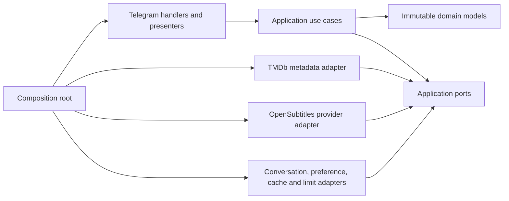

# Architecture

SubMate follows dependency inversion: source dependencies point toward the domain and
application layers, while concrete services are assembled once in `app/bootstrap.py`.

## Layer rules

- `app/domain` contains media, language, subtitle, and normalized error concepts. It
  imports no framework, network client, database driver, provider, or Telegram code.
- `app/application` owns workflows and state transitions. It depends only on the
  domain and protocols in `app/application/ports`.
- `app/infrastructure` implements the ports for TMDb, OpenSubtitles, Redis,
  PostgreSQL, and single-process fallbacks.
- `app/bot` parses Telegram updates and renders structured outcomes. Handlers do not
  construct providers, access databases, choose cache keys, retry calls, rank
  subtitles, or mutate conversation records.
- `app/bootstrap.py` is the only composition root. It constructs one shared
  `aiohttp.ClientSession`, injects every adapter, and owns deterministic shutdown.

## Workflow consistency

Temporary conversations use opaque workflow IDs and expire lazily after 30 minutes.
Durable language preferences live behind a separate repository. Every state-changing
use case acquires a per-user lock, and transitions replace immutable conversation
records. Cancellation replaces the workflow identity, invalidating every old callback.

Subtitle candidates retain both an opaque provider ID and opaque provider file
reference. Telegram callbacks use the workflow, provider, and stored candidate index;
provider-specific temporary links never leave the adapter.
